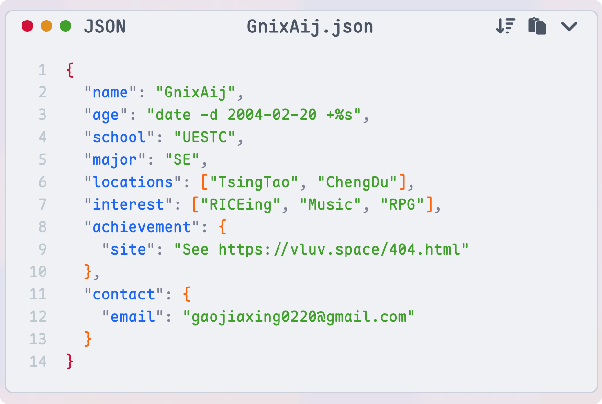
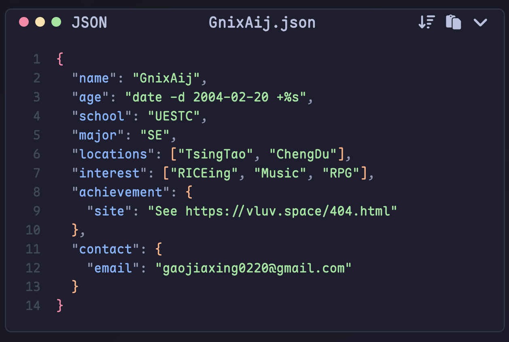

## Preview

Dark & Light Theme

|  |  |
| --------------------------------- | ------------------------------- |

Transformers Preview


For live Preview, check my [blog](https://vluv.space/shiki_highlight/)

## Install

```bash
bun i hexo-shiki-highlight
```

Add the following configuration to your Hexo `_config.yml`:

```yaml _config.yml
syntax_highlighter: shiki
```

If you want to customize the highlighter settings, add a `shiki` section in `_config.yml` like below:

```yaml _config.yml
shiki:
  light_theme: 'catppuccin-latte'
  dark_theme: 'catppuccin-mocha'

  toolbar_items:
    lang: true
    title: true
    wrapToggle: true
    copyButton: true
    shrinkButton: true # toggle code collapse/expand

  code_collapse:
    enable: true # Enable code collapse feature. Default is true.
    max_lines: 20 # Maximum lines to show before collapsing. Default is 20.
    show_lines: 10 # Number of lines to show when collapsed. Default is 10.

  # --- Advanced Settings ---
  exclude_languages: ['mermaid'] # Languages to exclude from Shiki highlighting.
  language_aliases: {
    'sh': 'bash'
  }
  enable_transformers: true
```

Supported themes & language can be found at [Shiki Themes](https://shiki.style/themes) & [Shiki Languages](https://shiki.style/languages).

## Dev

For development purpose, you can clone the repo and link it locally:

```shell
$ git clone https://github.com/Efterklang/hexo-shiki-highlight.git ~/Projects/hexo-dev/hexo-shiki-highlight
$ cd path_to_your_hexo_blog
$ bun i ~/Projects/hexo-dev/hexo-shiki-highlight
$ hexo clean
$ hexo s
```

## Thanks to

- [github.com/nova1751/hexo-shiki-plugin](https://github.com/nova1751/hexo-shiki-plugin)
- [github.com/HPCesia/hexo-highlighter-shiki](https://github.com/HPCesia/hexo-highlighter-shiki)
- [github.com/gxt-kt/hexo-plugin-shiki](https://github.com/gxt-kt/hexo-plugin-shiki)
