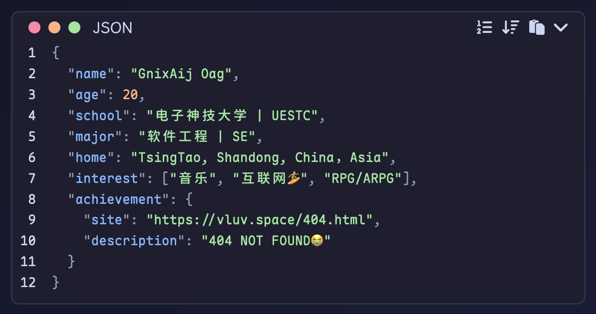

# Intro

个人博客[vluv's space](https://vluv.space/)使用的代码高亮插件，基于 [Shiki](https://shiki.style/) 实现。



## Install

`bun i hexo-shiki-highlight --save`

## Usage

Add the following configuration to your Hexo `_config.yml`:

```yaml
shiki:
  # --- Core Settings ---
  light_theme: 'catppuccin-latte' # Shiki theme for light mode.
  dark_theme: 'catppuccin-mocha'  # Shiki theme for dark mode.

  # --- Theme Integration ---
  # The class name your theme adds to the <body> or <html> tag for dark mode.
  # This plugin will generate CSS to automatically switch themes based on this class.
  # It supports both `body.dark` and `html[data-theme="dark"]` patterns.
  dark_mode_class: 'night' # Default is 'night'.

  # --- Display Settings ---
  line_number: true # Show line numbers. Default is true.
  highlight_wrap_toggle: true # Show wrap toggle button. Default is true.
  highlight_lang: true # Show language name. Default is true.
  highlight_title: true # Show code block title (if any). Default is true.
  highlight_copy: true # Show copy button. Default is true.
  highlight_raw: true # Show raw code button. Default is true.

  # --- Code Block Dimensions ---
  is_highlight_shrink: false # Shrink code block by default. Default is false.
  highlight_height_limit: 0 # Code block height limit in px. 0 means no limit. Default is 0.

  # --- Advanced Settings ---
  exclude_languages: [] # Languages to exclude from Shiki highlighting.
  language_aliases: {} # Language aliases. e.g., { "vue": "html" }
  transformers: [] # Shiki transformers for advanced syntax manipulation.

  # --- UI Text ---
  copy:
    success: 'Copied!' # Message on successful copy.
    error: 'Copy failed!' # Message on failed copy.
```

Supported themes & language can be found at [Shiki Themes](https://shiki.style/themes) & [Shiki Languages](https://shiki.style/languages).

## Customization

This plugin is designed to be easily customizable. The visual styles are split into two files located in `node_modules/hexo-shiki-highlight/code_block/`:

- `shiki.css`: Controls the layout, structure, and non-color aspects of the code block. You generally shouldn't need to edit this file.
- `color.css`: Controls all the colors of the code block's UI (borders, toolbar background, line numbers, etc.).

To customize the appearance, you can directly edit the CSS variables at the top of `color.css`.

### Example: Changing the border color

1. Open `node_modules/hexo-shiki-highlight/code_block/color.css`.
2. Find the `:root` section for the light theme, and the `.theme-switcher-class` section for the dark theme.
3. Modify the `--hl-border-color` variable:

```css
/* In color.css */

/* Light theme */
:root {
  --hl-border-color: #cccccc; /* Changed to a new light gray */
  /* ... other variables */
}

/* Dark theme placeholder */
.theme-switcher-class {
  --hl-border-color: #555555; /* Changed to a new dark gray */
  /* ... other variables */
}
```

4. Run `hexo clean && hexo g` to see your changes.

## Refs

- [github.com/nova1751/hexo-shiki-plugin](https://github.com/nova1751/hexo-shiki-plugin)
- [github.com/HPCesia/hexo-highlighter-shiki](https://github.com/HPCesia/hexo-highlighter-shiki)
- [github.com/gxt-kt/hexo-plugin-shiki](https://github.com/gxt-kt/hexo-plugin-shiki)
